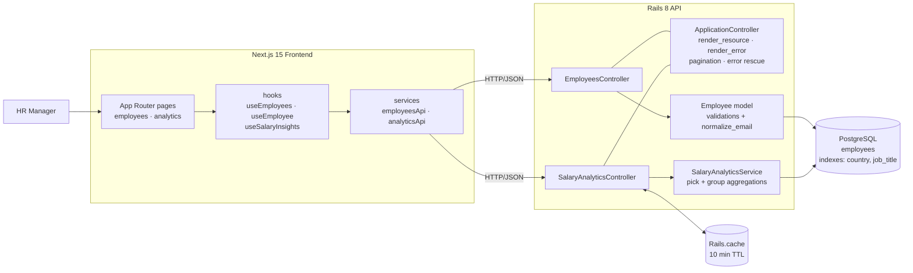
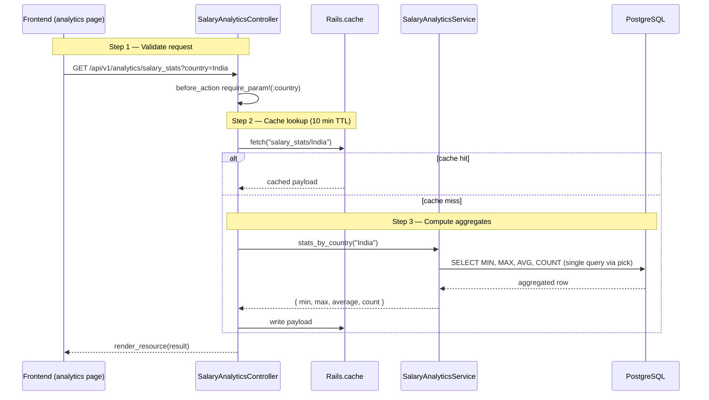
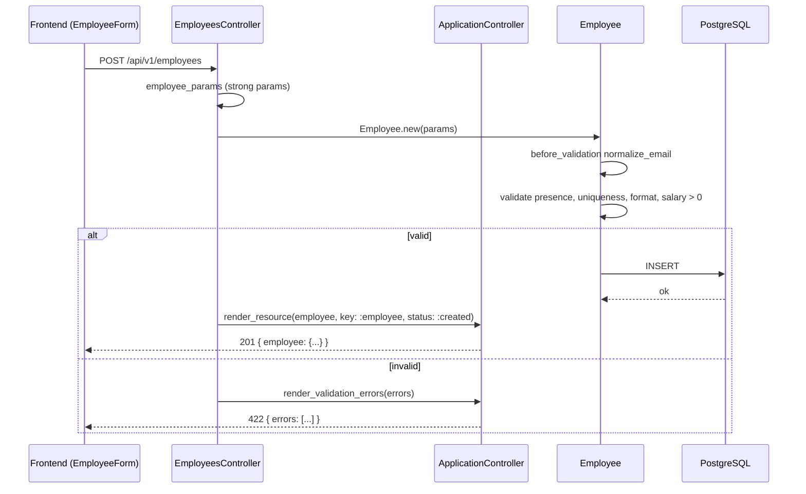
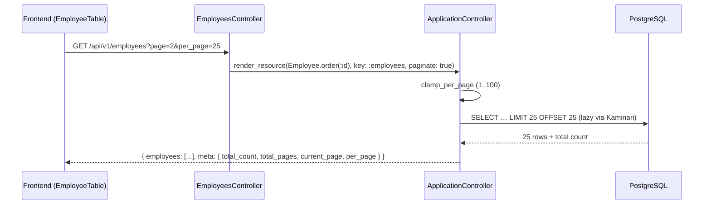

# Architecture Decisions

## System Diagrams

### High-Level Structure



### Salary Analytics Request Flow



### Employee Create Flow



### Employee Listing (paginated)



## Backend Architecture

### Why Rails API-only
- The doc requires a backend with a relational database. Rails provides convention-over-configuration which accelerates development while maintaining structure.
- API-only mode strips unnecessary middleware (sessions, cookies, views) keeping the stack lean.

### Why PostgreSQL
- Required salary aggregations (MIN, MAX, AVG, COUNT) are handled efficiently at the database level.
- `LOWER(email)` unique index ensures case-insensitive email uniqueness at the DB level, not just Rails validation.
- CHECK constraints (`salary > 0`) provide defense-in-depth beyond application-layer validation.

### Controller Design
- Controllers are thin — they handle request/response only.
- A shared `render_resource` helper in `ApplicationController` handles both single-record and paginated responses, reducing duplication across all CRUD actions.
- `before_action :set_employee` extracts record lookup for show/update/delete.
- `before_action :require_country` in the analytics controller centralizes param validation.

### Service Layer
- `SalaryAnalyticsService` encapsulates all salary aggregation logic with optimized SQL queries.
- `stats_by_country` uses `pick()` with raw SQL to fetch MIN, MAX, AVG, COUNT in a single query instead of 4 separate calls.
- `average_by_job_title` is dual-purpose: returns a single average when `job_title` is specified, or all titles ranked by average when omitted. This eliminates the need for a separate "top paying titles" endpoint.

### Seeding Strategy
- Seed logic lives in `db/seeders/employee_seeder.rb`, not in `app/services/` — it's a data loading concern, not business logic.
- Country and job title data stored as JSON files in `db/data/` for easy modification without code changes.
- Names assigned via index-based modulo (`i % size`) instead of random sampling for deterministic, reproducible data.
- Country and job title use different modulo bases to avoid alignment (every country gets all 10 job titles).
- `insert_all` in batches of 1,000 within a transaction for performance.
- Production guard prevents accidental execution in production.

## Frontend Architecture

### Why Next.js 15 + Ant Design
- Next.js provides App Router with file-based routing — maps cleanly to the two main pages (employees, analytics).
- Ant Design provides production-ready components (Table with pagination, Form with validation, Modal, Select, Statistic cards) out of the box.
- Recharts for salary visualizations — lightweight and composable.

### Project Structure
```
src/
├── types/          Shared TypeScript interfaces
├── lib/            API client (Axios wrapper)
├── hooks/          Data fetching hooks (useEmployees)
├── components/     Reusable UI components (AppShell, EmployeeTable, EmployeeForm)
└── app/            Pages (employees, employees/[id], analytics)
```

### Key Decisions
- Types extracted into `src/types/` — single source of truth for Employee, PaginationMeta, SalaryStats, etc.
- `useEmployees` hook encapsulates fetch logic with page + perPage support.
- `EmployeeTable` is a presentational component — receives data and callbacks, no internal state.
- `EmployeeForm` auto-maps country to currency using a shared `COUNTRY_CURRENCY` constant.
- Fixed sidebar with sticky page headers — only content area scrolls.
- Per-page size changer (10/25/50/100) wired end-to-end from UI to API.

## Database Design

```
employees
├── full_name        (string, NOT NULL)
├── email            (string, NOT NULL, LOWER unique index)
├── job_title        (string, NOT NULL, indexed)
├── country          (string, NOT NULL, indexed)
├── salary           (decimal 10,2, NOT NULL, CHECK > 0)
├── currency         (string, default "USD")
├── employment_status (string, NOT NULL, default "active", indexed)
├── date_of_joining  (date)

Indexes: country, job_title, [country + job_title], employment_status
```

### Why these indexes
- `country` — every analytics query filters by country.
- `job_title` — average salary by job title query.
- `[country, job_title]` — composite index covers the most common analytics pattern.
- `employment_status` — HR managers frequently filter by status.

## API Design

Three endpoint groups with consistent patterns:
- **Employees CRUD** — standard REST. Payload keyed by resource name (`employee` / `employees`) inside the envelope.
- **Analytics** — read-only endpoints returning aggregated data. `salary_by_job_title` serves dual purpose (single title or all titles) based on params.
- **Error handling** — centralized in `ApplicationController` with `StandardError → 500`, `RecordNotFound → 404`, `ParameterMissing → 400`.

### Response envelope

Every response follows the same shape so the frontend can parse uniformly.

Success (single / analytics):
```json
{ "success": true, "data": { "employee": { ... } } }
```

Success (paginated):
```json
{
  "success": true,
  "data": { "employees": [ ... ] },
  "meta": { "total_count": 128, "total_pages": 6, "current_page": 1, "per_page": 25 }
}
```

Validation errors (array):
```json
{ "success": false, "errors": ["Email has already been taken", "Salary must be greater than 0"] }
```

Single error (param missing, not found, server error):
```json
{ "success": false, "error": "country param is required" }
```

The frontend `lib/api.ts` installs an axios response interceptor that unwraps `{ success, data, meta }` so downstream services and hooks see the inner payload directly (plus a lifted `meta` for paginated responses).
